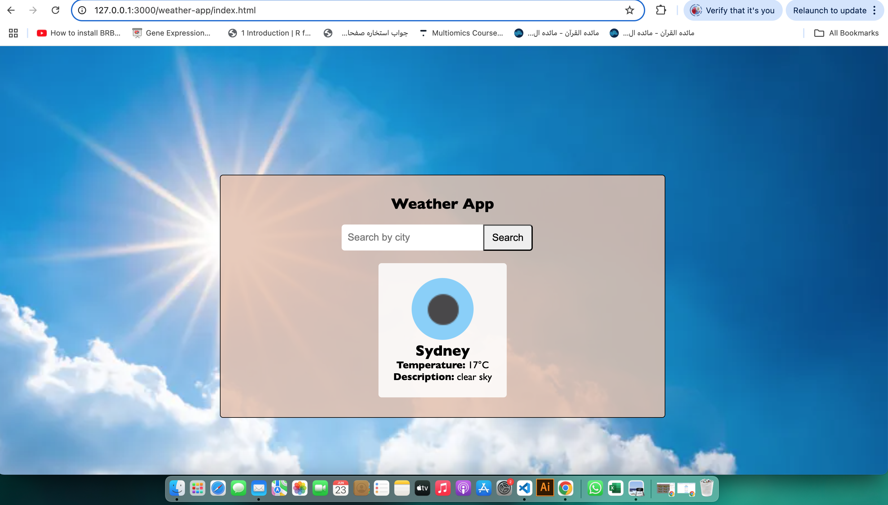

# Weather App 🌤️

A simple weather app that fetches real-time weather data using the OpenWeatherMap API.

## Live Preview
Click here: https://m-mustafa512.github.io/Weather-App-/




## Features
- City-based weather search
- Backend with Node.js + Express
- API key protection using `.env`
- Responsive frontend with HTML/CSS/JS

## Tech Stack
- Node js
- Express
- OpenWeatherMap API
- HTML, CSS, JavaScript


## Run Locally

```bash
# Install dependencies
npm install express node-fetch dotenv cors

# Start the server
node server.js
